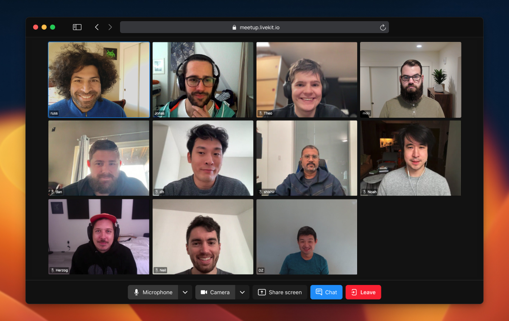

<!--BEGIN_BANNER_IMAGE-->
  <picture>
    <source media="(prefers-color-scheme: dark)" srcset="/.github/banner_dark.png">
    <source media="(prefers-color-scheme: light)" srcset="/.github/banner_light.png">
    
  </picture>
  <!--END_BANNER_IMAGE-->

<h1>
  LiveKit Components
</h1>

<!--BEGIN_DESCRIPTION-->Use this SDK to add real-time video, audio and data features to your React app. By connecting to a self- or cloud-hosted <a href="https://livekit.io/">LiveKit</a> server, you can quickly build applications like interactive live streaming or video calls with just a few lines of code.<!--END_DESCRIPTION-->

<br>



## About LiveKit Components

Create your [LiveKit](https://livekit.io) WebRTC experience without worrying about state. LiveKit Components give you a declarative way to build your real-time LiveKit audio/video frontend with React.

Every use case is different and apps in the real world are individual and unique. We don't pretend to have the perfect solution that fits all use cases. Instead, we've taken an approach where we give you reasonable defaults, without taking away full control over each component if you want it.

### 🤩 LiveKit Components handle all state for you

You don't have to worry about participant or room events to update the state of your application. All components handle state management for you, and by using React contexts, you don't have to route properties through your component tree.

### 🛠️ Carefully crafted set of components

We offer all the necessary building blocks to build a live video or audio app in no time.

### 🚀 Beautiful and sane defaults

We put a lot of effort into creating components that work and look great right out of the gate. Get started quickly by using the defaults of your components or overwrite them by simply adding children.

```tsx
//1️⃣ Use the components defaults to render a video conference app
<LiveKitRoom token="my-token" serverUrl="wss://my-livekit-server" connect={true} >
  <VideoConference />
</LiveKitRoom>

// 2️⃣ or overwrite the defaults with your custom component tree.
<LiveKitRoom >
  <ParticipantLoop>
    {/*  */}
  </ParticipantLoop>
</LiveKitRoom>

```

### 🎨 Style them the way you want

Because most of the components are merely wrappers around standard HTML-Elements you can overwrite the basic component style how ever you want.

On top of that we provide a handful of pre-defined css variables to easily theme LiveKit Components to your needs.

To add styling from our @livekit/components-styles package:

Import all styles including the default theme

```ts
import '@livekit/components-styles';
```

And add a theme data attribute to the `<LiveKitRoom/>` or any HTML container, to gain access to default LiveKit styles.

```html
<div data-lk-theme="default"...
```

### 📈 Room to grow: create your own components

The component we offer does not fit your requirements? We have the solution for you! Each component comes with its own React hook that allows you to create your own component with minimal boilerplate. Of course, you can also combine your own component with our pre-built components. It's common to start with our components to quickly sketch out a concept, and then replace some of them with your own components to build something we could never have imagined.

## Get started

The best way to get started is to use the [`@livekit/components-react`](/packages/react/) package and install it.

```bash
yarn add @livekit/components-react livekit-client
```

or

```bash
npm install @livekit/components-react livekit-client
```

Creating a full fledged video conference is as easy as

```tsx
import { LiveKitRoom, VideoConference } from '@livekit/components-react';

export function App() {
  return (
    <LiveKitRoom token="<livekit-token>" serverUrl="<url-to-livekit-server>" connect={true}>
      <VideoConference />
    </LiveKitRoom>
  );
}
```

## Examples

There are some basic example on how to use and customize LiveKit Components in the [nextjs example folder](./examples/nextjs/)

In order to set the examples up locally follow the [development guide](#development-setup).

We also have a fully featured video conferencing application built on top of LiveKit Components [here](https://github.com/livekit/meet) that powers https://meet.livekit.io.

## FAQ

### Why is there a @livekit/components-core package?

By abstracting most of the state handling logic into a common core we wanted to make sure that other framework implementations can be created with minimal code duplication. We chose observables as the main data structure for this core as its concepts translate really well to for example React's hooks, solid's signals, Svelte's stores, Vue's composables, and angular loves observables out of the box.

### Did you consider using Custom Elements?

Yes, we did consider building LK Components with custom elements (web components). We ultimately decided against it in order to give users the option to develop within the constraints of their chosen framework with all its specific concepts (e.g. in the case of react hooks, context etc.). That said the road towards supporting custom elements isn't entirely closed off. If the adoption of custom elements gains traction we can imagine providing a framework implementation that additionally compiles to custom elements (e.g. solid or svelte).

### Will there be an implementation for my favorite framework?

The highest priority is currently to get the core and react packages to a stable version that people love to work with. Once this is done we will decide on what other frameworks we might to support officially. If you want to develop an implementation for your favorite framework based on the core package we'd love to talk to you about it!

## Development Setup

### Setup Monorepo

This repo consists of multiple packages that partly build on top of each other.
It relies on yarn workspaces and [Turborepo](https://turbo.build/repo/docs) (which gets installed automatically).

On the root level:

```bash
yarn install
```

In order to link up initial dependencies and check whether everything has installed correctly run

```bash
yarn build
```

This will build all the packages in `/packages` and the examples in `/examples` once.

After that you can use a more granular command to only rebuild the packages you are working on.
E.g. to test and automatically rebuild package dependencies for the nextjs example, run:

```bash
yarn dev:next
```

> **Note** for the examples to work you'll need to make sure to copy the the contents of .env.example in the specific example folder to a newly created .env.local file and adjust the values accordingly to your livekit server setup.

#### Setup Husky pre-push checks

To get immediate feedback on whether CI will pass, you can set Husky to run check whenever you push to origin.
Setting it up is as simple as running `yarn prepare`.

<!--NAV_START-->

## Monorepo Navigation

- [Home 👈](/README.md)
- **Docs**
  - [Docs](/docs/alpha-docs/README.md)
  - [Storybook](/docs/storybook/README.md)
- **Framework Implementations**:
  - [React](/packages/react/README.md)
- **Examples**
  - [Next.js](/examples/nextjs/README.md)
- **Internal Packages**
  - [Core](/packages/core/README.md)
  - [Styles](/packages/styles/README.md)

<!--NAV_END-->
<!--BEGIN_REPO_NAV-->

<br/><table>

<thead><tr><th colspan="2">LiveKit Ecosystem</th></tr></thead>
<tbody>
<tr><td>Client SDKs</td><td><b>Components</b> · <a href="https://github.com/livekit/client-sdk-js">JavaScript</a> · <a href="https://github.com/livekit/client-sdk-swift">iOS/macOS</a> · <a href="https://github.com/livekit/client-sdk-android">Android</a> · <a href="https://github.com/livekit/client-sdk-flutter">Flutter</a> · <a href="https://github.com/livekit/client-sdk-react-native">React Native</a> · <a href="https://github.com/livekit/client-sdk-rust">Rust</a> · <a href="https://github.com/livekit/client-sdk-python">Python</a> · <a href="https://github.com/livekit/client-sdk-unity-web">Unity (web)</a> · <a href="https://github.com/livekit/client-sdk-unity">Unity (beta)</a></td></tr><tr></tr>
<tr><td>Server SDKs</td><td><a href="https://github.com/livekit/server-sdk-js">Node.js</a> · <a href="https://github.com/livekit/server-sdk-go">Golang</a> · <a href="https://github.com/livekit/server-sdk-ruby">Ruby</a> · <a href="https://github.com/livekit/server-sdk-kotlin">Java/Kotlin</a> · <a href="https://github.com/agence104/livekit-server-sdk-php">PHP (community)</a> · <a href="https://github.com/tradablebits/livekit-server-sdk-python">Python (community)</a></td></tr><tr></tr>
<tr><td>Services</td><td><a href="https://github.com/livekit/livekit">Livekit server</a> · <a href="https://github.com/livekit/egress">Egress</a> · <a href="https://github.com/livekit/ingress">Ingress</a></td></tr><tr></tr>
<tr><td>Resources</td><td><a href="https://docs.livekit.io">Docs</a> · <a href="https://github.com/livekit-examples">Example apps</a> · <a href="https://livekit.io/cloud">Cloud</a> · <a href="https://docs.livekit.io/oss/deployment">Self-hosting</a> · <a href="https://github.com/livekit/livekit-cli">CLI</a></td></tr>
</tbody>
</table>
<!--END_REPO_NAV-->
