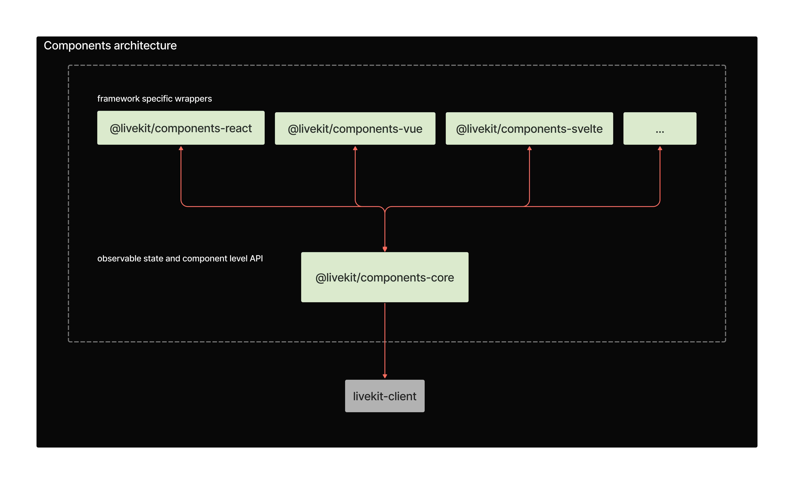

# LiveKit Components

Create your LiveKit experience without worrying about state.

<!--NAV_START-->

## Monorepo Navigation

- [Home 👈](/README.md)
- **Docs**
  - [Docs](/docs/alpha-docs/README.md)
  - [Storybook](/docs/storybook/README.md)
- **Framework Implementations**:
  - [React](/packages/react/README.md)
- **Examples**
  - [Next.js](/examples/nextjs/README.md)
- **Internal Packages**
  - [Core](/packages/core/README.md)
  - [Styles](/packages/styles/README.md)

<!--NAV_END-->

## Development Setup

### Setup Monorepo

This repo consists of multiple packages that partly build on top of each other.
It relies on yarn workspaces and [Turborepo](https://turbo.build/repo/docs) (which gets installed automatically).

On the root level:

```bash
yarn install
```

In order to link up initial dependencies and check whether everything has installed correctly run

```bash
yarn build
```

This will build all the packages in `/packages` and the examples in `/examples` once.

After that you can use a more granular command to only rebuild the packages you are working on.
E.g. to test and automatically rebuild package dependencies for the nextjs example, run:

```bash
yarn dev:next
```

> **Note** for the examples to work you'll need to make sure to copy the the contents of .env.example in the specific example folder to a newly created .env.local file and adjust the values accordingly to your livekit server setup.

## Architecture Overview


