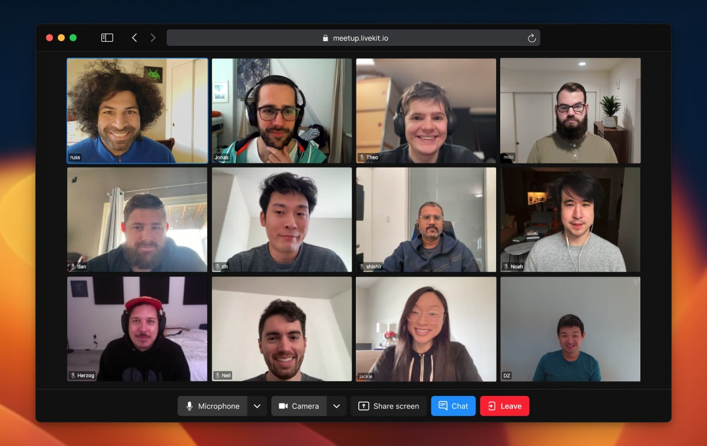

<!--BEGIN_BANNER_IMAGE-->

<picture>
  <source media="(prefers-color-scheme: dark)" srcset="/.github/banner_dark.png">
  <source media="(prefers-color-scheme: light)" srcset="/.github/banner_light.png">
  
</picture>

<!--END_BANNER_IMAGE-->

<h1>
  LiveKit Components
</h1>

<!--BEGIN_DESCRIPTION-->
Use this SDK to add realtime video, audio and data features to your React app. By connecting to <a href="https://livekit.io/">LiveKit</a> Cloud or a self-hosted server, you can quickly build applications such as multi-modal AI, live streaming, or video calls with just a few lines of code.
<!--END_DESCRIPTION-->

<br/>
<br/>



## Agents Quick Start

First add the library to your project:

```shell
npm i @livekit/components-react
```

Next, you need a running agent. If you don't already have one, [it only takes a few minutes to set one up](https://docs.livekit.io/agents/start/voice-ai).

The rest of this guide assumes your agent is configured for [explicit dispatch](https://docs.livekit.io/agents/worker/agent-dispatch/#explicit) with `agent_name="example-agent"`.

Then, you can use the agents sdk to connect and interact with your agent:

```tsx
import { useEffect, useState } from "react";
import { TokenSource } from "livekit-client";
import {
  useSession,
  useAgent,
  SessionProvider,
  VideoTrack,
  StartAudio,
  RoomAudioRenderer,
} from "@livekit/components-react";

// Generated credentials manually and put them here
// Or, generate them another way: https://github.com/livekit/client-sdk-js?tab=readme-ov-file#generating-a-urltoken-with-tokensource
const tokenSource = TokenSource.literal({
  serverUrl: "wss://my-livekit-server",
  participantToken: 'generated-jwt',
});

export default function Example() {
  const session = useSession(tokenSource, {
    agentName: 'example-agent', /* <== Put your agent name here! */
  });

  const toggleStarted = () => {
    if (session.connectionState === 'disconnected') {
      session.start();
    } else {
      session.end();
    }
  };

  const { messages, send, isSending } = useSessionMessages(session);
  const [chatMessage, setChatMessage] = useState('');

  const agent = useAgent(session);

  return (
    <SessionProvider session={session}>
      <button onClick={toggleStarted} disabled={session.connectionState === 'connecting'}>
        {session.isConnected ? 'Disconnect' : 'Connect'}
      </button>

      {session.isConnected ? (
        <div className="flex flex-col gap-4 p-4">
          <span>
            <strong>Connection State:</strong>
            {session.connectionState}
          </span>
          <span>
            <strong>Agent State:</strong>
            {agent.state}
          </span>

          {/* Local and agent camera feeds: */}
          {session.local.cameraTrack ? (
            <VideoTrack trackRef={session.local.cameraTrack} />
          ) : null}
          {agent.cameraTrack ? (
            <VideoTrack trackRef={agent.cameraTrack} />
          ) : null}

          {/* Chat messages (including transcriptions): */}
          <ul>
            {messages.map(receivedMessage => (
              <li key={receivedMessage.id}>{receivedMessage.message}</li>
            ))}
            <li className="flex items-center gap-1">
              <input
                type="text"
                value={chatMessage}
                onChange={e => setChatMessage(e.target.value)}
                className="border border-2"
              />
              <button
                disabled={isSending}
                onClick={() => {
                  send(chatMessage);
                  setChatMessage('');
                }}
              >{isSending ? 'Sending' : 'Send'}</button>
            </li>
          </ul>
    
          <StartAudio label="Start audio" />
          <RoomAudioRenderer />
        </div>
      ) : null}
    </SessionProvider>
  );
}
```

### Video Conference Quick Start

First add the library to your project:

```shell
npm i @livekit/components-react
```

Then use any of our pre-fabricated or helper components:

```tsx
import { LiveKitRoom, VideoConference } from '@livekit/components-react';

const TOKEN = 'generated-jwt';
const WS_URL = 'wss://my-livekit-server';

export default function Example() {
  return (
    <LiveKitRoom token={TOKEN} serverUrl={WS_URL} connect={true}>
      <VideoConference />
    </LiveKitRoom>
  );
}
```

## Docs

For more information checkout the [LiveKit Components Docs](https://docs.livekit.io/reference/components/react/)

## Examples

There are some basic examples of how to use and customize LiveKit components in this mono repo. They are located in the nextjs examples folder [`/examples/nextjs`](./examples/nextjs/). In order to set the examples up locally follow the [Development Setup](#development-setup).

We also have a fully featured video conferencing application built on top of LiveKit Components. Start a video conference at [meet.livekit.io](https://meet.livekit.io) and take a look at the implementation in the [livekit-examples/meet](https://github.com/livekit-examples/meet) repo.

## Development Setup

If you are interested in contributing to the project or running the examples that are part of this mono-repository, then you must first set up your development environment.

### Setup Monorepo

This repo consists of multiple packages that partly build on top of each other.
It relies on pnpm workspaces and [Turborepo](https://turbo.build/repo/docs) (which gets installed automatically).

Clone the repo and run `pnpm install` the root level:

```shell
pnpm install
```

In order to link up initial dependencies and check whether everything has installed correctly run

```shell
pnpm build
```

This will build all the packages in `/packages` and the examples in `/examples` once.

After that you can use a more granular command to only rebuild the packages you are working on.
E.g. to test and automatically rebuild package dependencies for the nextjs example, run:

```shell
pnpm dev:next
```

> **Note**
> For the examples to work you'll need to make sure to copy the the contents of .env.example in the specific example folder to a newly created .env.local file and adjust the values accordingly to your livekit server setup.

## FAQ

<details>
<summary>
Why is there a `@livekit/components-core` package?
</summary>
By abstracting most of the state handling logic into a common core we wanted to make sure that other framework implementations can be created with minimal code duplication. We chose observables as the main data structure for this core as its concepts translate really well to for example React's hooks, solid's signals, Svelte's stores, Vue's composables, and angular loves observables out of the box.
</details>

<details>
<summary>
Did you consider using Custom Elements?
</summary>
Yes, we did consider building LK Components with custom elements (web components). We ultimately decided against it in order to give users the option to develop within the constraints of their chosen framework with all its specific concepts (e.g. in the case of react hooks, context etc.). That said the road towards supporting custom elements isn't entirely closed off. If the adoption of custom elements gains traction we can imagine providing a framework implementation that additionally compiles to custom elements (e.g. solid or svelte).
</details>

<details>
<summary>
Will there be an implementation for my favorite framework?
</summary>
The highest priority is currently to get the core and react packages to a stable version that people love to work with. Once this is done we will decide on what other frameworks we might to support officially. If you want to develop an implementation for your favorite framework based on the core package we'd love to talk to you about it!
</details>

<!--NAV_START-->

## Monorepo Navigation

- [Home 👈](/README.md)
- **Framework Implementations**:
  - [React](/packages/react/README.md)
- **Examples**
  - [Next.js](/examples/nextjs/README.md)
- **Internal Packages**
  - [Core](/packages/core/README.md)
  - [Styles](/packages/styles/README.md)
  - [Shadcn](/packages/shadcn/README.md)

<!--NAV_END-->
<!--BEGIN_REPO_NAV-->
<br/><table>
<thead><tr><th colspan="2">LiveKit Ecosystem</th></tr></thead>
<tbody>
<tr><td>LiveKit SDKs</td><td><a href="https://github.com/livekit/client-sdk-js">Browser</a> · <a href="https://github.com/livekit/client-sdk-swift">iOS/macOS/visionOS</a> · <a href="https://github.com/livekit/client-sdk-android">Android</a> · <a href="https://github.com/livekit/client-sdk-flutter">Flutter</a> · <a href="https://github.com/livekit/client-sdk-react-native">React Native</a> · <a href="https://github.com/livekit/rust-sdks">Rust</a> · <a href="https://github.com/livekit/node-sdks">Node.js</a> · <a href="https://github.com/livekit/python-sdks">Python</a> · <a href="https://github.com/livekit/client-sdk-unity">Unity</a> · <a href="https://github.com/livekit/client-sdk-unity-web">Unity (WebGL)</a> · <a href="https://github.com/livekit/client-sdk-esp32">ESP32</a></td></tr><tr></tr>
<tr><td>Server APIs</td><td><a href="https://github.com/livekit/node-sdks">Node.js</a> · <a href="https://github.com/livekit/server-sdk-go">Golang</a> · <a href="https://github.com/livekit/server-sdk-ruby">Ruby</a> · <a href="https://github.com/livekit/server-sdk-kotlin">Java/Kotlin</a> · <a href="https://github.com/livekit/python-sdks">Python</a> · <a href="https://github.com/livekit/rust-sdks">Rust</a> · <a href="https://github.com/agence104/livekit-server-sdk-php">PHP (community)</a> · <a href="https://github.com/pabloFuente/livekit-server-sdk-dotnet">.NET (community)</a></td></tr><tr></tr>
<tr><td>UI Components</td><td><b>React</b> · <a href="https://github.com/livekit/components-android">Android Compose</a> · <a href="https://github.com/livekit/components-swift">SwiftUI</a> · <a href="https://github.com/livekit/components-flutter">Flutter</a></td></tr><tr></tr>
<tr><td>Agents Frameworks</td><td><a href="https://github.com/livekit/agents">Python</a> · <a href="https://github.com/livekit/agents-js">Node.js</a> · <a href="https://github.com/livekit/agent-playground">Playground</a></td></tr><tr></tr>
<tr><td>Services</td><td><a href="https://github.com/livekit/livekit">LiveKit server</a> · <a href="https://github.com/livekit/egress">Egress</a> · <a href="https://github.com/livekit/ingress">Ingress</a> · <a href="https://github.com/livekit/sip">SIP</a></td></tr><tr></tr>
<tr><td>Resources</td><td><a href="https://docs.livekit.io">Docs</a> · <a href="https://github.com/livekit-examples">Example apps</a> · <a href="https://livekit.io/cloud">Cloud</a> · <a href="https://docs.livekit.io/home/self-hosting/deployment">Self-hosting</a> · <a href="https://github.com/livekit/livekit-cli">CLI</a></td></tr>
</tbody>
</table>
<!--END_REPO_NAV-->


