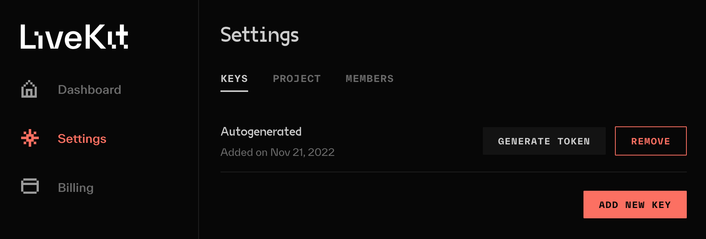
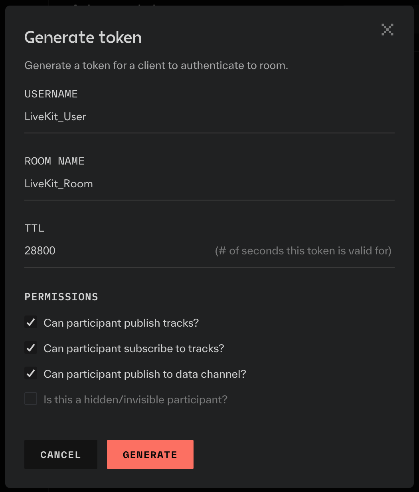

# Setup a LiveKit Cloud project

Short guide to show you how to setup a project and generate a user access token with LiveKit Cloud

---

LiveKit Cloud is our hosted LiveKit server solution. It has a generous free plan and is easy to use. If you want to join, visit [cloud.livekit.id](https://cloud.livekit.io/login) and sign up for a free plan (no credit card required).

## Create a new LiveKit Cloud project

After registration, create a new project – name it whatever you want.

## Generate access token

In your created project navigate to _Settings_ > _Keys_, there you should see a key with the name _Autogenerated_.

As the name indicated this key was autogenerated for you at project creation. Let's utilize it by clicking _Generate Token_. A modal like in the picture below should appear.

> **Info** Just to clarify. This manual process of generating a user access token is normally done automatically by the server SDK, we only do this for testing purposes.

Fill out the _Generate token_ form by filling in the username `test-user` and the room name `test-room`. You don't have to modify the permissions, the defaults are perfectly fine.
Increased the value in the time to live (TTL) field to `28800` seconds (which converts to 8 hours). Hit _Generate_ to generate a new access token. This user access token is only valid for `test-room` on your server and for only 8 hours. Copy the generated token, we are going to need it in a bit.

## Server URL

Still in your LiveKit project, navigate to _Settings_ > _Project_ and copy the server URL for later use.

With the server URL and user access token, you now have everything you need to connect to the LiveKit Cloud backend from your front end.
