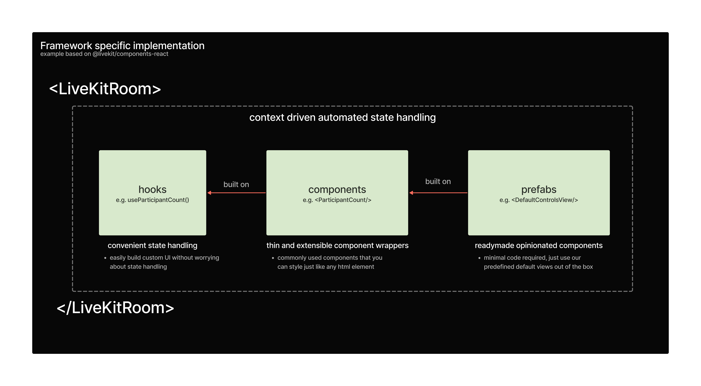

# LiveKit Components **React**

A LiveKit Components implementation in [React](https://reactjs.org/).

<!--NAV_START-->

## Monorepo Navigation

- [Home](../../README.md)
- **Framework Implementations**:
  - [React 👈](../../packages/react/README.md)
- **Examples**
  - [Next.js](../../examples/nextjs/README.md)
- **Internal Packages**
  - [Core](../../packages/core/README.md)
  - [Styles](../../packages/styles/README.md)

<!--NAV_END-->

## Install

```bash
npm install @livekit/components-react
```

## Usage

```tsx
import { LiveKitRoom } from '@livekit/components-react';

<LiveKitRoom token="<livekit-token>" serverUrl="<url-to-livekit-server>" connect={true} />;
```

## Architecture Overview


